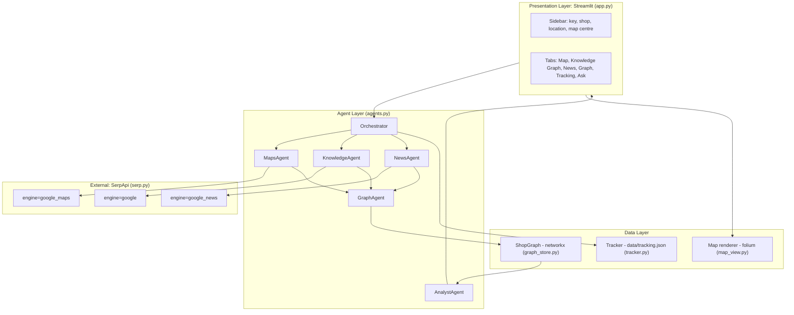
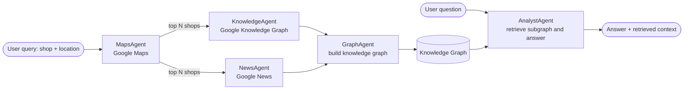
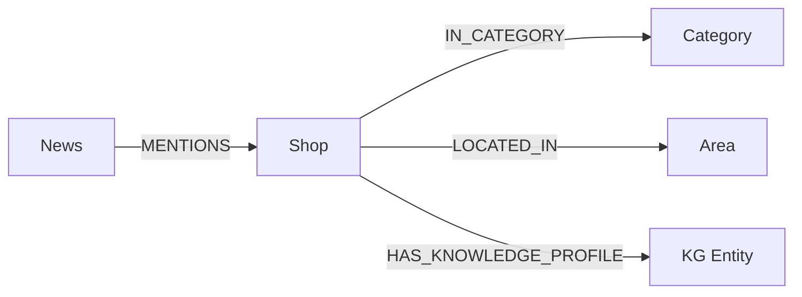
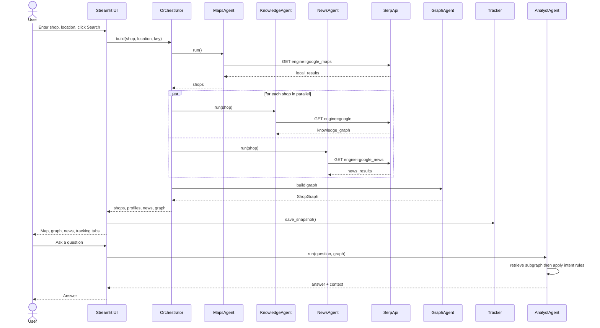
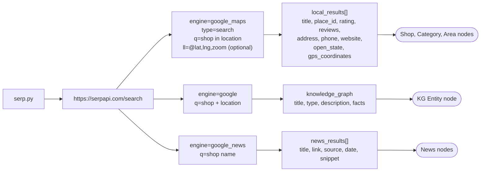

# 🛍️ Shop Tracker — Multi-Agent GraphRAG

A Streamlit app that tracks shops and their locations using **Google Maps**, **Google Knowledge Graph** and **Google News** (via [SerpApi](https://serpapi.com)). It builds a knowledge graph from the results and answers questions with graph-based retrieval. **Only a SerpApi key is required.**

## Table of Contents
1. [Features](#features)
2. [System Architecture](#system-architecture)
3. [Multi-Agent Architecture](#multi-agent-architecture)
4. [Data Flow Sequence](#data-flow-sequence)
5. [SerpApi Integration](#serpapi-integration)
6. [API Endpoints Architecture](#api-endpoints-architecture)
7. [Quick Start](#quick-start)
8. [Usage](#usage)
9. [Testing](#testing)
10. [Project Structure](#project-structure)
11. [License](#license)

---

## Features
- 📍 **Shop discovery**: search any shop type in any location (Google Maps API)
- 🧠 **Entity profiles**: Google Knowledge Graph panel per shop
- 📰 **News tracking**: latest Google News articles per shop
- 🗺️ **Interactive map**: rating-coloured pins, popup cards, light/dark/satellite layers
- 🕸️ **Knowledge graph view**: shops, categories, areas, entities and news linked together
- 📈 **Change tracking**: a snapshot is saved on every search, so rating, review and status changes show up over time
- 💬 **Graph Q&A**: ask about best rating, news, contacts, hours or addresses (no LLM needed)
- ⚡ **Parallel enrichment**: Knowledge Graph and News calls run concurrently

---

## System Architecture



| Layer | Responsibility | Files |
|---|---|---|
| Presentation | Inputs, tabs, charts, chat | `app.py`, `map_view.py` |
| Agents | Orchestrate and enrich data | `agents.py` |
| Data | Graph store, map, snapshots | `graph_store.py`, `tracker.py` |
| Integration | HTTP calls to SerpApi | `serp.py` |

---

## Multi-Agent Architecture



| Agent | Input | Output |
|---|---|---|
| `MapsAgent` | shop type, location, optional `ll` | list of shops (rating, address, coordinates) |
| `KnowledgeAgent` | shop title + location | Knowledge Graph panel (description, facts) |
| `NewsAgent` | shop title | up to 5 recent articles |
| `GraphAgent` | shops, profiles, news | networkx graph |
| `AnalystAgent` | question + graph | markdown answer + retrieved context |

**Graph schema**



---

## Data Flow Sequence



---

## SerpApi Integration

All calls go through one function in `serp.py`:

```python
GET https://serpapi.com/search?engine=<engine>&q=<query>&api_key=<KEY>&output=json
```

| Function | Engine | Used for |
|---|---|---|
| `maps_search()` | `google_maps` | shop list, ratings, coordinates |
| `knowledge_graph()` | `google` | Knowledge Graph panel |
| `news_search()` | `google_news` | recent articles |

Errors (missing key, bad key, quota, non-200) are raised as `SerpError` and shown in the UI. Knowledge Graph and News failures for a single shop are swallowed so one bad call does not stop the whole run.

**Cost per search:** `1 (Maps) + 2 x N shops`. For example, 6 shops use 13 SerpApi calls.

---

## API Endpoints Architecture



| Endpoint | Key parameters | Response fields used |
|---|---|---|
| `engine=google_maps` | `q`, `type=search`, `ll`, `hl` | `local_results` (or `place_results`) |
| `engine=google` | `q`, `hl` | `knowledge_graph` |
| `engine=google_news` | `q`, `hl` | `news_results` (including nested `stories`) |

---

## Quick Start

**Requirements:** Python 3.10+, a [SerpApi key](https://serpapi.com/manage-api-key)

**Windows (batch files)**
```bat
setup.bat        :: creates venv, installs packages, creates .env
:: edit .env -> SERPAPI_API_KEY=your_key
run.bat          :: starts the app at http://localhost:8501
```

**Manual**
```bash
python -m venv venv
venv\Scripts\activate          # Linux/macOS: source venv/bin/activate
pip install -r requirements.txt
cp .env.example .env           # then add your key
streamlit run app.py
```

**.env**
```
SERPAPI_API_KEY=your_serpapi_key_here
```

---

## Usage

1. Open the app and enter your SerpApi key (or load it from `.env`).
2. Fill in **Shop / category** (e.g. `coffee shop`) and **Location** (e.g. `Pune, India`).
3. *(Optional)* **Map centre** `@lat,lng,zoom` such as `@18.5204,73.8567,14z` to focus on a neighbourhood.
4. Choose **Shops to enrich** (2 to 10) and click **Search & build graph**.
5. Explore the tabs:

| Tab | What you see |
|---|---|
| 📍 Shops & Map | Table plus interactive map with rating-coloured pins |
| 🧠 Knowledge Graph API | Raw Knowledge Graph profile for each shop |
| 📰 News | Latest articles per shop |
| 🕸️ Graph | Interactive knowledge graph (drag, zoom, hover) |
| 📈 Tracking | Changes since last search and a rating-over-time chart |
| 💬 Ask | Graph Q&A |

**Tracking over time:** run the same search again later (same shop and location). The Tracking tab compares the two latest snapshots.

**Example questions for the Ask tab**

| Ask | Returns |
|---|---|
| `Which shop has the best rating?` | Ranking table |
| `Latest news` / `news for Alpha` | Linked articles |
| `Phone numbers` | Phone and website |
| `Which are open now?` | Opening status |
| `Where is Alpha located?` | Address, area, coordinates |
| `Tell me about Alpha` | Profile with Knowledge Graph description |

---

## Testing

Tests use mocked SerpApi responses, so they need no API key and use no credits.

```bash
pip install -r requirements-dev.txt
pytest -v
```
On Windows: `test.bat`

| Area | What is tested |
|---|---|
| `serp.py` | parsing Maps results, missing key, API errors, news `stories` flattening |
| `graph_store.py` | node types, subgraph retrieval |
| `AnalystAgent` | ranking, news intent, shop-name filtering |
| `tracker.py` | rating change detection |
| `Orchestrator` | full pipeline with mocked calls |

---

## Project Structure
```
shop-tracker-graphrag/
├── app.py                 Streamlit UI
├── agents.py              Agents and orchestrator
├── serp.py                SerpApi wrappers
├── graph_store.py         Knowledge graph and retrieval
├── map_view.py            Styled folium map
├── tracker.py             Snapshots and change detection
├── tests/test_core.py     Unit tests
├── requirements.txt
├── requirements-dev.txt
├── setup.bat / run.bat / test.bat / push_to_github.bat
├── .env.example
└── LICENSE
```


---

## License
Released under the [MIT License](LICENSE).
